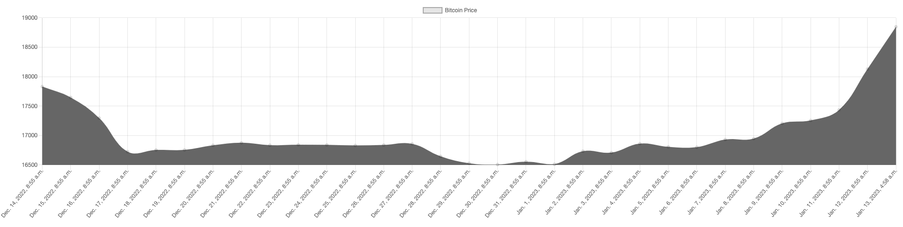
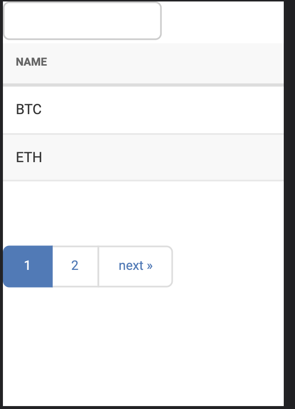

This is a Django Project which consist 3 parts:

1. Bitcoin Chart

- Fetch the bitcoin data with api
- Save the data to MySql Database
- Query the data from database
- Use Chart.js to make data as line chart.
- 
  

3. Custom View Table

- Use Django_filter
- Use Django_table2
- Searching field
- Pagination
- Table
- 
  The css of django_table2 is not work except CSS3 but CSS3 is not responsive. After that, I use Django Admin Page
  Library
  to style the table and also the pagination.